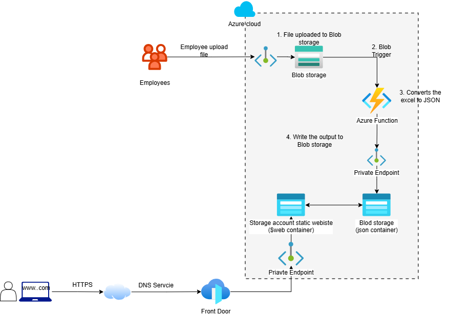

# Azure POS Map Serverless Solution

A serverless Azure solution that automatically updates a public POS location website when business users upload an Excel file.

## Business Problem

Opening hours and POS information change frequently during:
- Public holidays
- Ramadan
- Special events
- Branch closures

Manually updating the website is time-consuming and error-prone.

## Solution

Users upload an Excel file to Azure Blob Storage.

Azure Functions automatically:

1. Detect the file upload
2. Validate the Excel format
3. Convert the data into JSON
4. Publish the JSON to the website

The static website consumes the JSON file and updates automatically.

## Architecture

## Azure Services Used

- Azure Storage Account
- Azure Blob Storage
- Azure Static Website
- Azure Functions
- Application Insights
- Azure Front Door (optional)
- GitHub Actions

## Features

- Event-driven architecture
- Serverless design
- Low operational cost
- Automated Excel processing
- Custom domain support
- CI/CD ready

## Technology Stack

- Python
- Azure Functions
- Azure Storage
- JavaScript
- HTML/CSS
- GitHub Actions

## Future Improvements

- Azure Front Door
- Managed Identity
- Private Endpoints
- Terraform deployment
